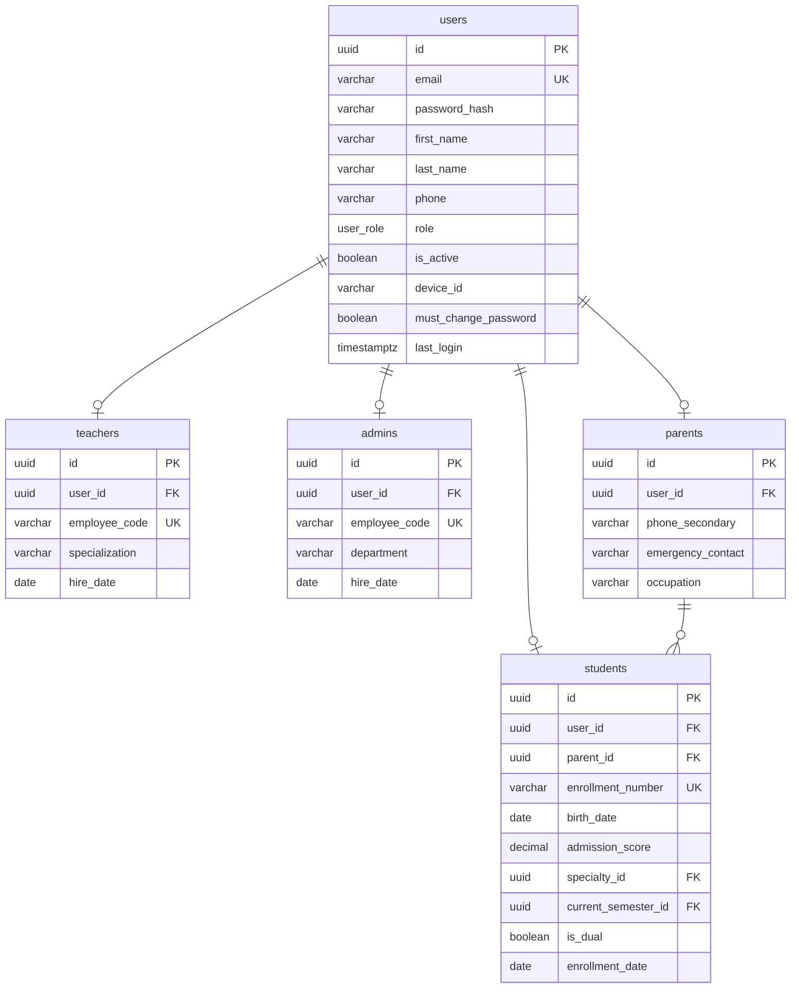
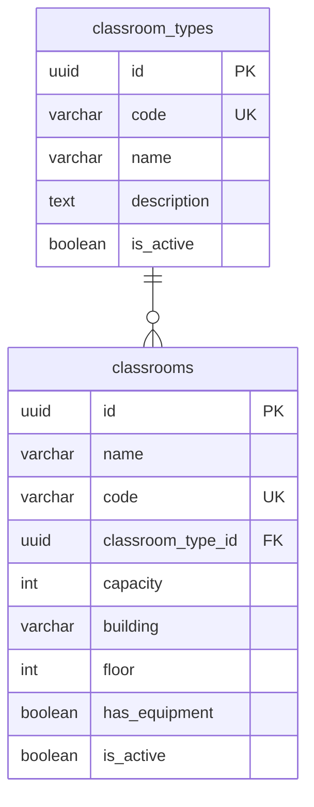
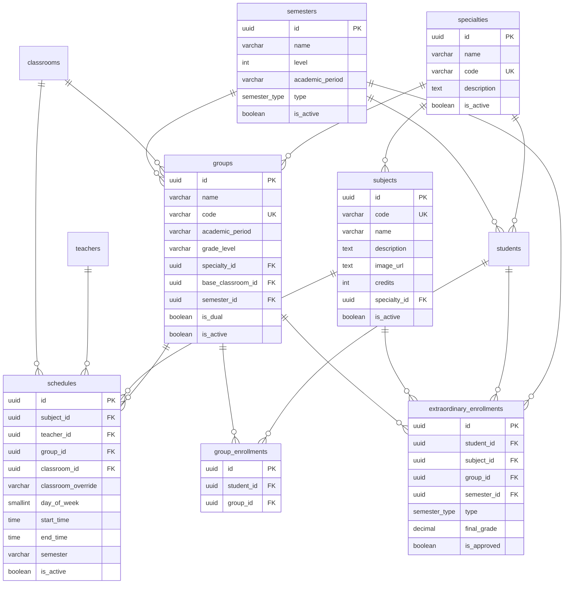
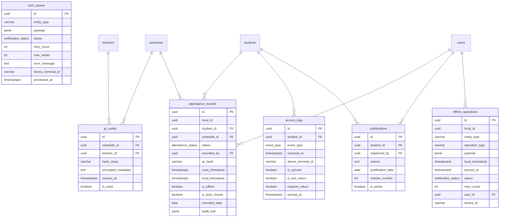
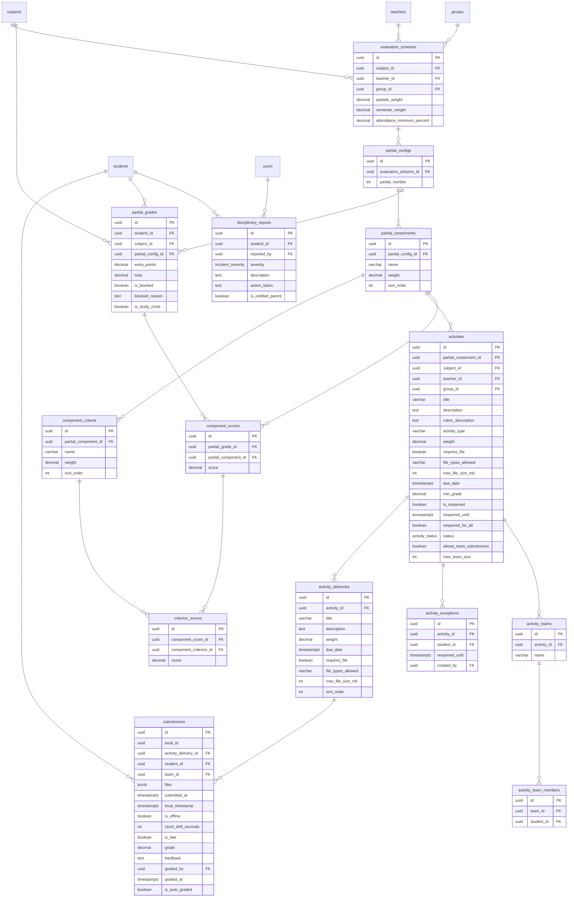
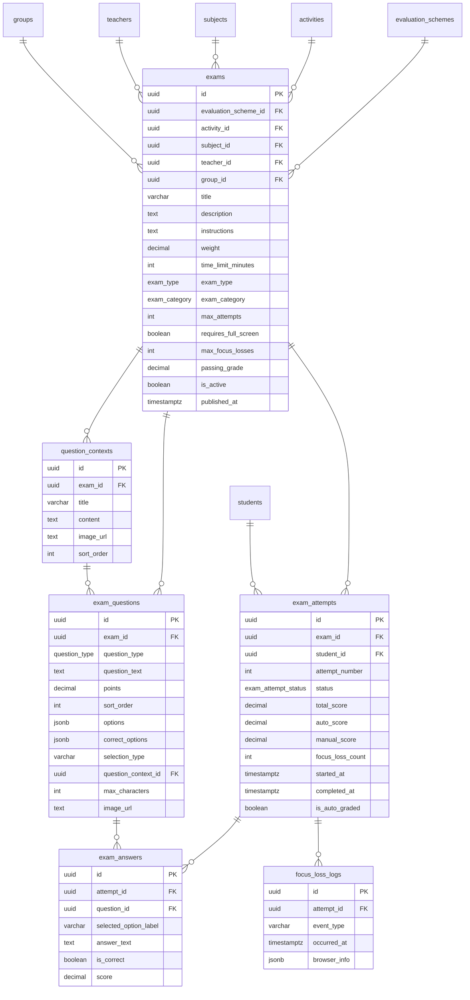
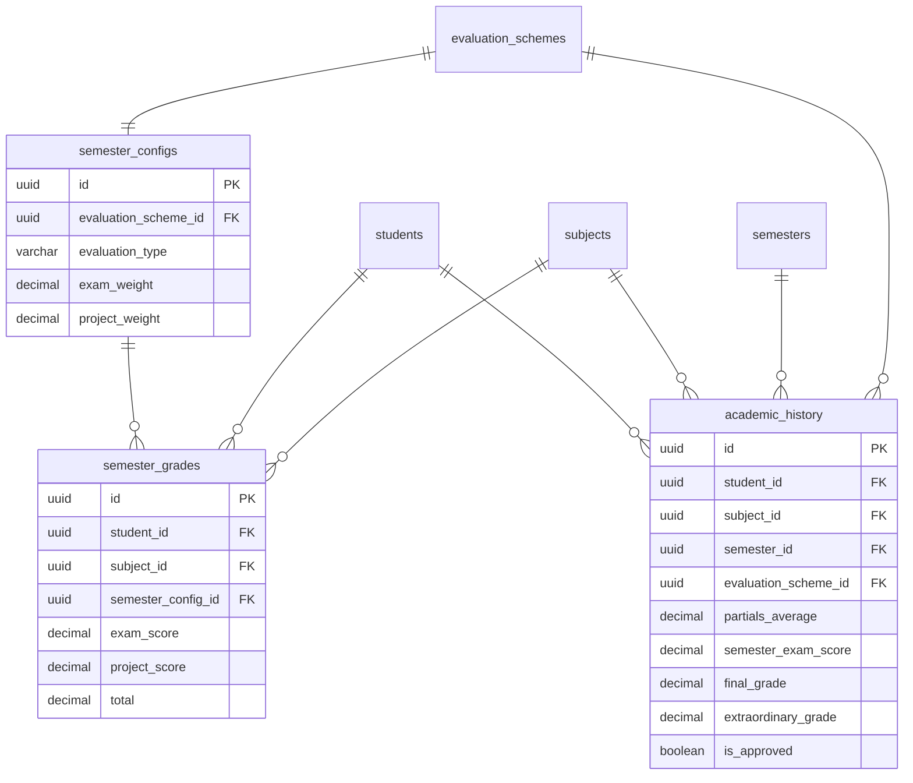
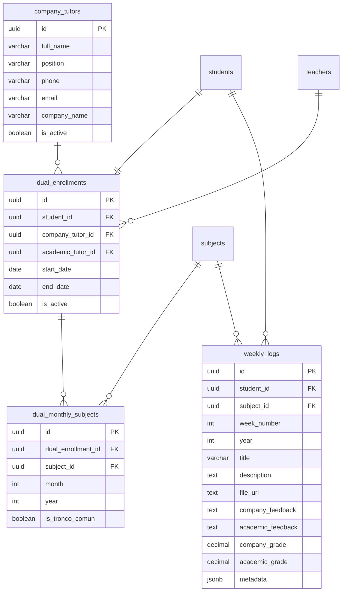
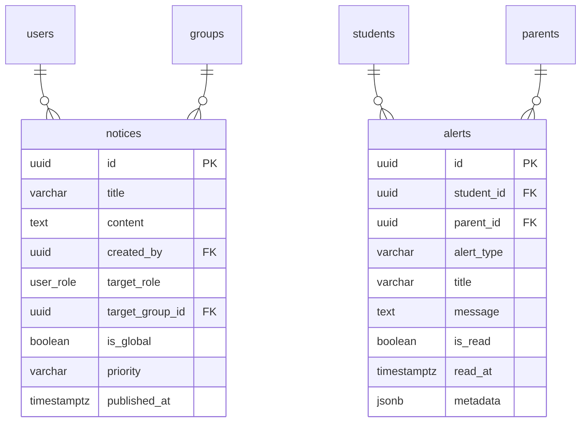
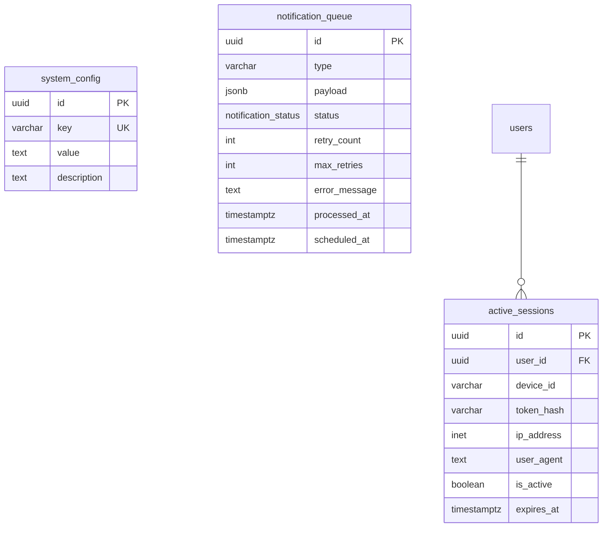

# Diagramas Mermaid por Módulo

## 1. Módulo Users

## 2. Módulo Classrooms

## 3. Módulo Academic

## 4. Módulo Attendance

## 5. Módulo Evaluation

## 6. Módulo Exams

## 7. Módulo Semester

## 8. Módulo Dual

## 9. Módulo Notifications

## 10. Módulo Infrastructure

